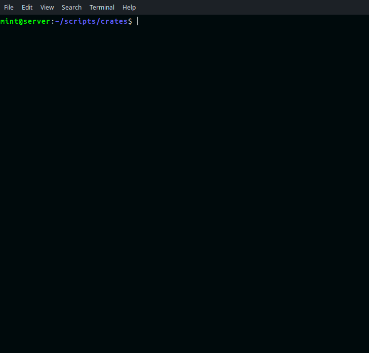

# Introduction

 - Collect prices of defined coins 
 - Save data into object
 - Save to CSV and print colorized output
 - Print-only without saving
 - Save-only without printing

# How to run

Run from terminal:

```ruby
ruby bin/crates usd eur rsd
ruby bin/crates usd eur rsd --no-save
ruby bin/crates usd eur rsd --no-print
```    

# How to use

Initialize new object: 
 
 - first parameter is currency, default is `:eur`  
 - other accepted options are `print: , save: `, defaults to `true`,  
 - and `coins: `, array of coins you want to scrap, or use hardcoded

```ruby
# prepare everything for request
@rates = C::Rates.new :eur, coins: %w[BTC XMR LTC], print: false
# execute request
@rates.get
```  

This will print/save data as configured, while making prices easily
accessible with Rates#prices and Rates#price(:symbol).

```ruby
# Hash with all prices (:prices)
# Accessible with @rates['BTC']

@rates.prices

 # => { "BTC"=>48867.67, "XMR"=>200.31, "LTC"=>164.37 }


# Get price for coin you want (Rates#price)

@rates.price(:btc)      #symbol
 # => 48867.67

@rates.price('xmr')     #string
 # => 200.31
```  

Get accept same parameters as C::Rates.new.
This will not change default configuration.

```ruby
@rates.get :usd, print: true, save: false, coins: %w[BTC XMR LTC]
 # => print data without saving (not change defaults)
```  

C::Rates has two setter methods:

```ruby
@rates.currency = 'EUR'

@rates.coins = %w[BTC XMR LTC]
```  

Other objects are:

```ruby
# After new object is initialized, you can use:

@rates.currency
 # => "EUR"

@rates.coins
 # => "BTC, XMR, LTC"

@rates.save?
 # => save output -> (true/false)

@rates.print?
 # => print output -> (true/false)

@rates.count
 # => 0 -> (number of fail requests)

# After you call Rates#get:

@rates.url
 # => constructed URL

@rates.reponse
 # => from RestClient.get (accept #code, #headers, #body)

@rates.data
 # => JSON parsed object will all data about all coins

@rates.table
 # => path to saved CSV file
```


